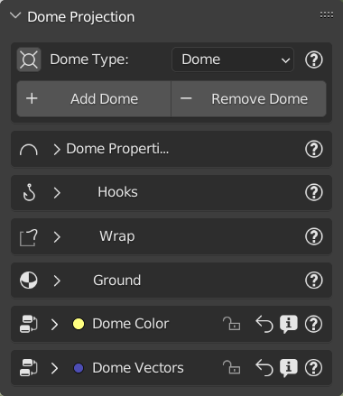
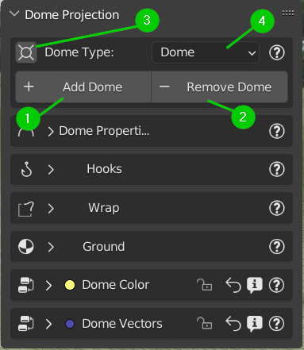

Dome Projection
===============

.. image:: _static/_images/dome_projection/dome_projection_example_no_wireframe_01.png
    :width: 800
    :align: center
    :alt: Dome Without Wireframe

Introduction:
-------------

The projection of an HDR/EXR or other formats on a dome is a great formula to work in a photo-realistic environment.
At the same time the classic way of working with "non-projected" backgrounds is very used, but this usually has big
limitations (No zoom, no ground, etc.)
So the dome Projection is a powerful function because it projects the image on a dome "Really existing"
with terrain. The terrain can also be made irregular through the features included in this menu.
In addition there are various types of dome, including the newest "Cube" dome that allows you to be modified through
the hook!

**Welcome to the Dome Projection Menu!**

.. image:: _static/_images/dome_projection/dome_projection_example_wireframe_01.png
    :width: 800
    :align: center
    :alt: Dome With Wireframe

**The Dome Projection menu is presented as you see in this image, it's composed of 7 submenus, which we will see more down**

Choose/Add/Remove Dome:
-----------------------

The first thing to do is to choose the dome you want to work with. Remember, the dome is a "real" object into your scene!
So, before adding a dome, make sure you have added a background through the "Add" button from the main HDRi Maker panel,
or you can also import one from your HDR/EXR background gallery (Even if it is not good practice, it will also accept
PNG, JPG, BMP, and all image formats accepted by blender)

1 :ref:'_target'

..  _target:

1. Add Dome
***********

Before continuing, make sure you have added a background through the "Add" button from the HDRi Maker main panel.

Choose a dome from the N4 property (Shown in the previous image) and click on "Add Dome" to add it to the scene.
This button, in addition to adding a new dome, also has the function of replacing the one already present in the scene
(if present) with the one chosen.

**Note:** The dome needs an image to load inside it, at the moment it only works if the scene has a background with an image
inside it. It doesn't matter what image, it will understand it by itself, through the node tree of the World material,
which image to load inside the dome. If the world background is not of type HDRi Maker, it doesn't matter, the first
Environment image found inside the World will be taken.

In short, if there are more than 1 Environment image in the world shader, the first one found will be taken and used for the dome.

2. Remove Dome:
***************

The "Remove" button, simply removes the dome present in the scene and nothing more

3. Center View In Dome:
***********************

This small button, serves to center the view at the center of the dome (We found it very useful in many situations)

4. Dome Type:
*************

This is the interesting part, here you can choose the type of Dome you want to use, currently there are 3 types of Dome, namely:

1. Dome:
--------
    Classic Dome, This dome is interesting and is the most classic of domes, It has a grid on the ground that allows
    to do the Wrap (Explained later here) ..TODO
    It can be scaled, and thanks to the HDRi Maker node system, the projection can be set, scaling the mapping of the ground,
    in order to have a larger or smaller ground, or smaller, depending on your needs.
    It is also possible to modify the mapping of the sky part, in order to be able to set the projection as best as possible.

    All this is explained better in the "Dome Projection Vector" section ..TODO

