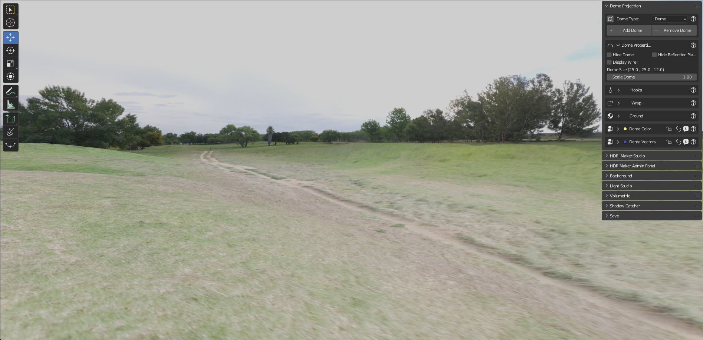

Dome Projection
===============

Introduction:
-------------

The projection of an HDR/EXR or other formats on a dome is a great formula to work in a photo-realistic environment.
At the same time the classic way of working with "non-projected" backgrounds is very used, but this usually has big
limitations (No zoom, no ground, etc.)
So the dome Projection is a powerful function because it projects the image on a dome "Really existing"
with terrain. The terrain can also be made irregular through the features included in this menu.
In addition there are various types of dome, including the newest "Cube" dome that allows you to be modified through
the hook!

**Welcome to the Dome Projection Menu!**

.. image:: _static/_images/dome_projection/dome_projection_example_wireframe_01.png
    :width: 800
    :align: center
    :alt: Main Panel

Choose/Add/Remove Dome:
-----------------------

The first thing to do is to choose the dome you want to work with. Remember, the dome is a "real" object into your scene!
So, before adding a dome, make sure you have added a background through the "Add" button from the main HDRi Maker panel,
or you can also import one from your HDR/EXR background gallery (Even if it is not good practice, it will also accept
PNG, JPG, BMP, and all image formats accepted by blender)

