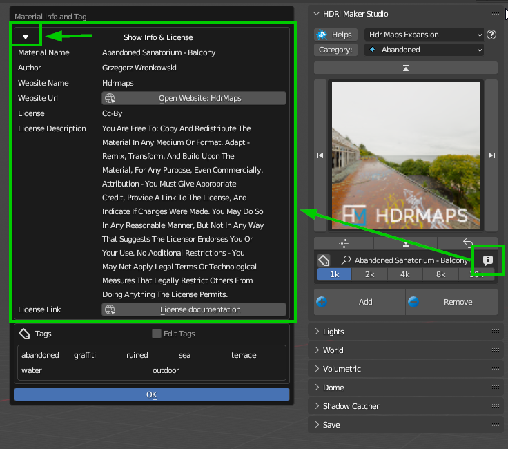

FAQs
=====================

Here below there are the most frequent questions and answers about the HDRi Maker addon. Even if you are not interested
I invite you to take a look. It could be useful for you.

Happy reading!
Andrew_D

------------------------------------------------------------------------------------------------------------------------

Come posso contattarti per assistenza?
***************************************

Se hai acquistato l'addon su BlenderMarket, vai direttamente nella pagina dell'addon e clicca su "Ask a question".

Which version of Blender is compatible?
***************************************

The addon is compatible with all versions from 3.0 (Included) onwards.

------------------------------------------------------------------------------------------------------------------------

How many backgrounds are included?
****************************************

At the moment there are almost 500 Backgrounds Included

------------------------------------------------------------------------------------------------------------------------

Can I use the backgrounds for commercial projects?
*******************************************************

Yes, the entire Default library of HDRi Maker is provided under CC0 license, so you can use it even without citing the license. If you want to use the backgrounds contained in the Hdr Maps expansion, you can do it, but you will have to cite the author and the license

In any case I have inserted in each Background the type of license of use. This can be viewed by pressing the Button
"Info" as in the image below, a popup opens, and from there you can see the type of license of use.

------------------------------------------------------------------------------------------------------------------------

Why are the library packages distributed in files of up to 2GB?
****************************************************************

This is because there are some users with a slow line, so files too big sometimes reach a timeout on Blendermarket.
This was a problem for some users in the past, so I decided to divide the packages into smaller files.

I understand that this is not the best way to distribute the packages, but it is the best solution for everyone.

In addition, those who have a fast line can download all the packages at once, and those who have a slow line can download the packages in more times.

------------------------------------------------------------------------------------------------------------------------

Are updates free?
***********************

HDRi Maker was born in 2019 and since then all users who have purchased the addon have received all updates for free. This means that if you buy the addon today, you will have access to all future updates.

So, Yes!

------------------------------------------------------------------------------------------------------------------------

If I bought a version that is not PRO, can I upgrade to PRO in the future?
******************************************************************************

Yes, you can do it, you will just have to buy the PRO version and you will only pay the difference in price.

------------------------------------------------------------------------------------------------------------------------

Do I have to install all the libraries?
********************************************

No, it is sufficient to install even only the 1k libraries, which occupy less than 1GB, the minimum to have HDRi Maker working.

------------------------------------------------------------------------------------------------------------------------

Do I need a powerful graphics card?
*****************************************

My advice is undoubtedly yes, but it is not mandatory. The important thing is to have a VRAM large enough, at least 4GB

------------------------------------------------------------------------------------------------------------------------

How much Video Memory is needed for 16k images?
***********************************************

Technically it would be useful to have at least 8GB of VRAM to run GPU rendering with such high resolutions

------------------------------------------------------------------------------------------------------------------------

With which rendering engines can I use HDRi Maker?
**************************************************

Cycles and Eevee are the rendering engines supported by HDRi Maker, support for other rendering engines is not planned at the moment

------------------------------------------------------------------------------------------------------------------------

Is there support?
*****************

Of course! You can contact me on https://blendermarket.com/ or on http://extreme-addons.com/
(On extreme-addons.com you can find a chat button in the bottom right corner)

------------------------------------------------------------------------------------------------------------------------

Can I use HDRi Maker on Software other than Blender?
****************************************************

At the moment support for other platforms is not planned, but it is possible that in the future there will be

------------------------------------------------------------------------------------------------------------------------

Can I export the dome as a 3D model?
*******************************************

Not yet, but it is possible that in the future there will be

------------------------------------------------------------------------------------------------------------------------

Can I import videos as backgrounds?
*****************************************

This is not currently planned for 2 reasons. Videos are currently huge in GB quantity, so we have not yet intended
to address the issue. I have also been asked many times if you can import videos made with the normal camera.
The answer is yes, but it doesn't make sense. It's not a VFX addon, so it's not planned to use it.

------------------------------------------------------------------------------------------------------------------------

Can I use my libraries?
******************************

Yes, but be careful! If they are libraries created with HDRi Maker yes. In the case in which you have HDR or EXR image libraries
you can create custom libraries in HDRi Maker with the use of Batch Save. This tool included in HDRi Maker
allows you to import in batch even hundreds of HDR / EXR backgrounds in one go, this makes it so that it creates a category
in the library "USER Library" so as to have in HDRi Maker all your custom libraries.

------------------------------------------------------------------------------------------------------------------------

Does it work with Blender Asset Browser?
*******************************************

I start from the assumption that at the moment HDRi Maker already has its integrated Asset Browser, so it is not necessary.
In addition, it is a tool dedicated to the creation of Scenes with Dome/Lights/Hooks interactive objects.

At the moment I do not consider it necessary to integrate it in Blender Asset Browser, since it is more dedicated to things "Done and finished"
while HDRi Maker builds the scene based on the buttons that are pressed from the interface itself of HDRi Maker.

In any case, I have built a small tool that will be shown in Asset Browser, in case you have a library in it of
HDR backgrounds. This Tenta to convert these backgrounds into an HDRi Maker background, so that you can use them in HDRi Maker with its
its functions. **Attention** this tool is still under development, so it may not work with all types
of background libraries of the Blender asset browser.

------------------------------------------------------------------------------------------------------------------------

The dome can be modified?
***************************

Yes, the dome "Cube" and the dome "Cylinder" can be manually modified to adapt the image to the perimeter of the dome. (Or vice versa)

------------------------------------------------------------------------------------------------------------------------

Will I get a perfect projection with the dome?
***********************************************

No, the projection will never be perfect 100% because the image is without Parallax, but given the wide use that is made today
of HDR and EXR images, you can safely say that with HDRi Maker you have an easy and innovative system to manage your domes
I personally think that it is the best you can find (But I am biased and my judgment counts little)

