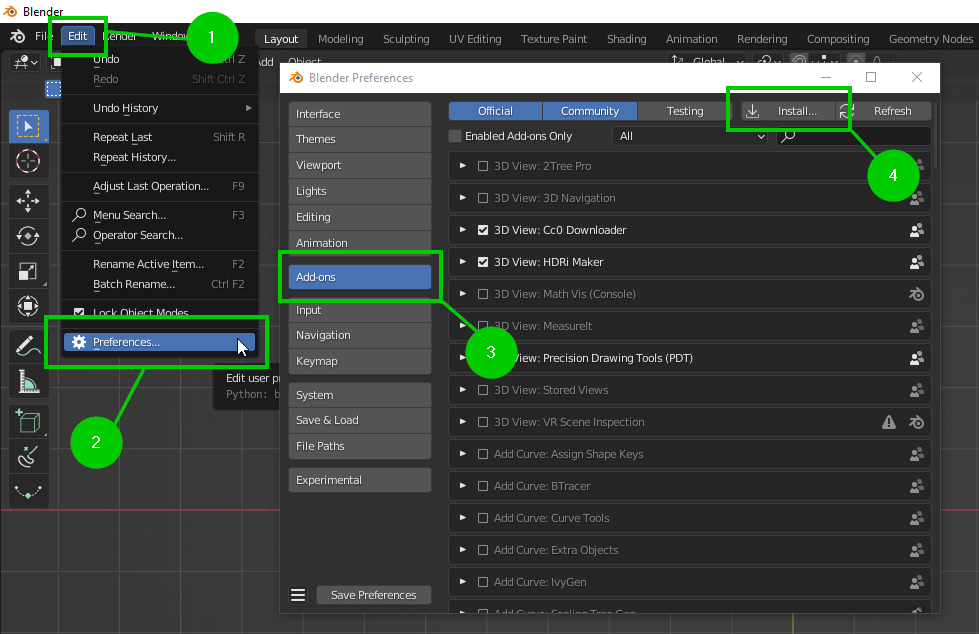
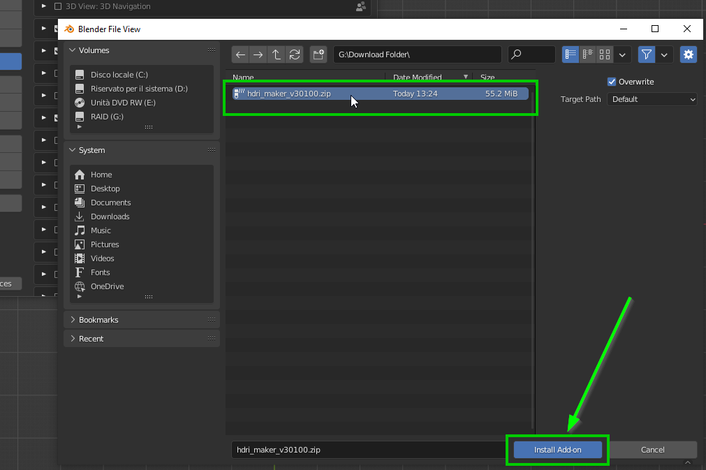
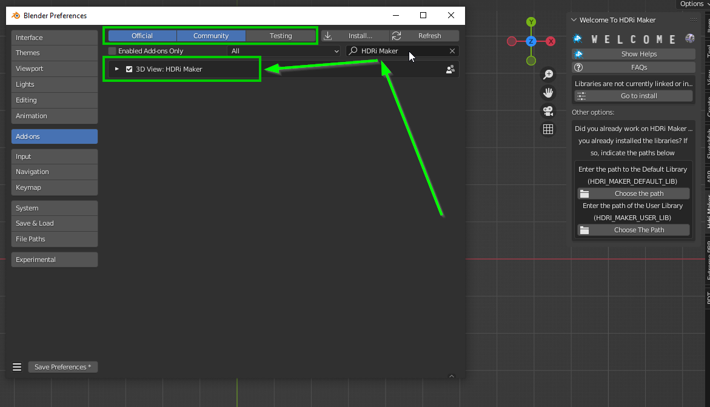
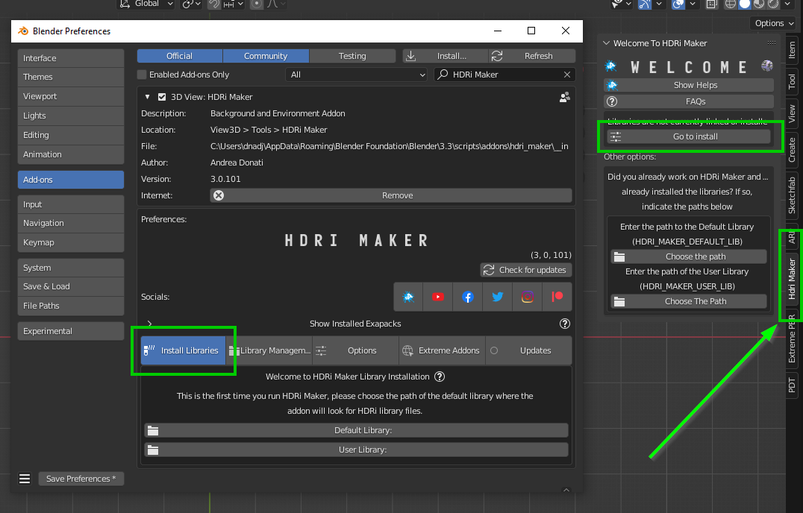
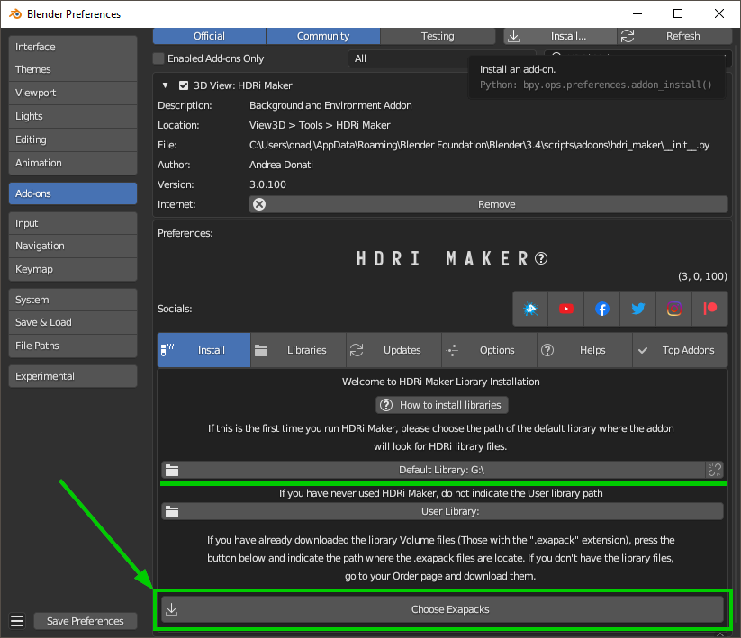
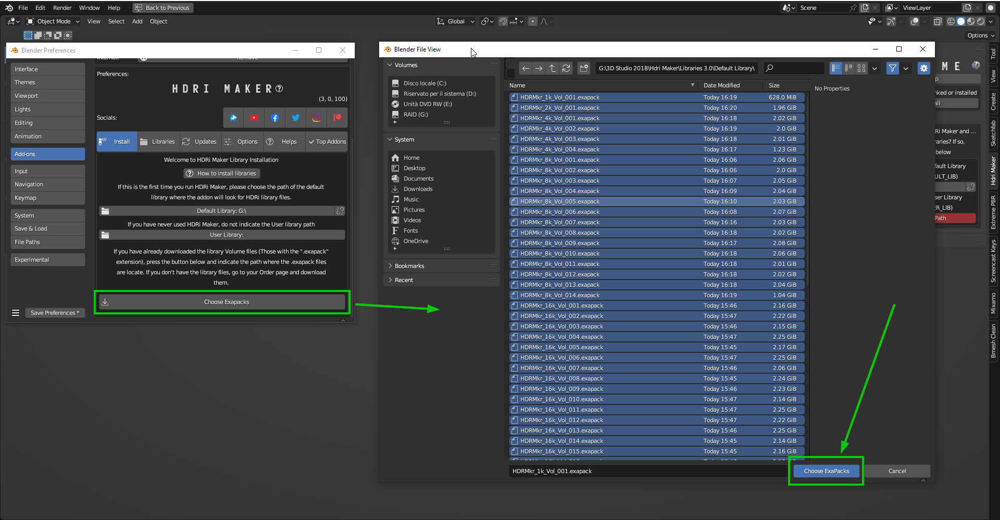
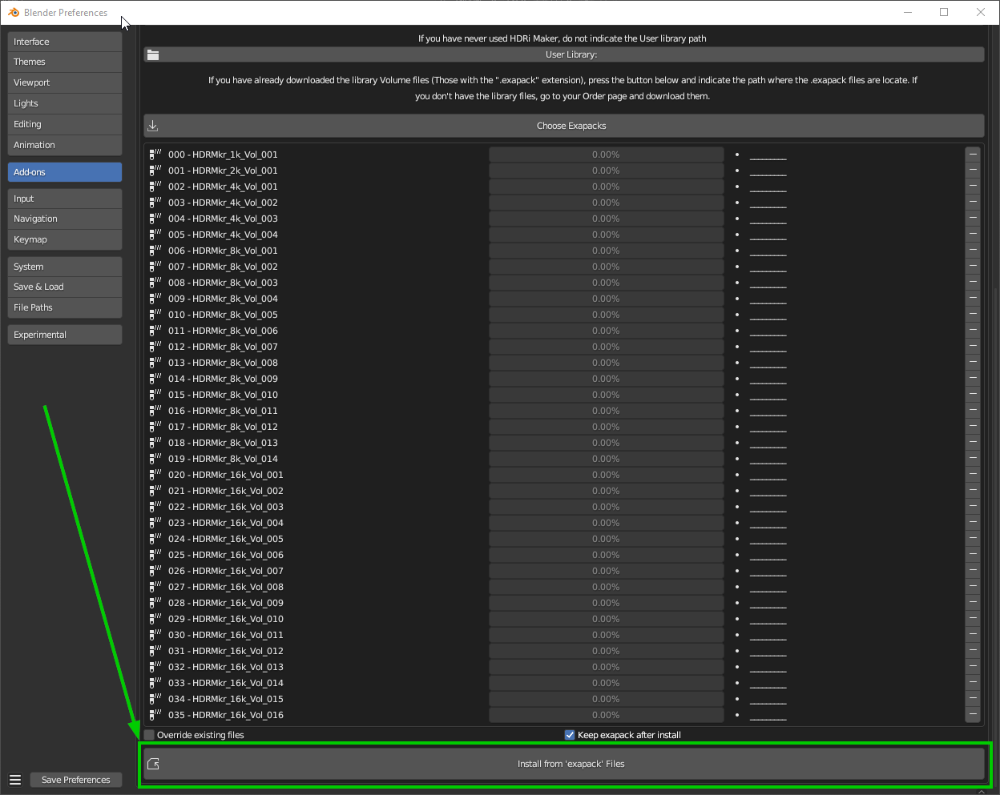
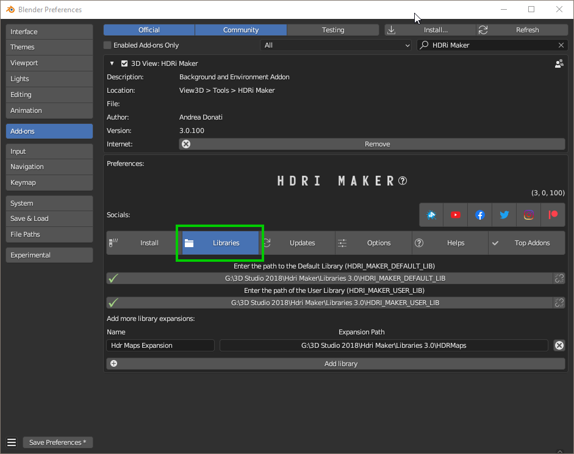
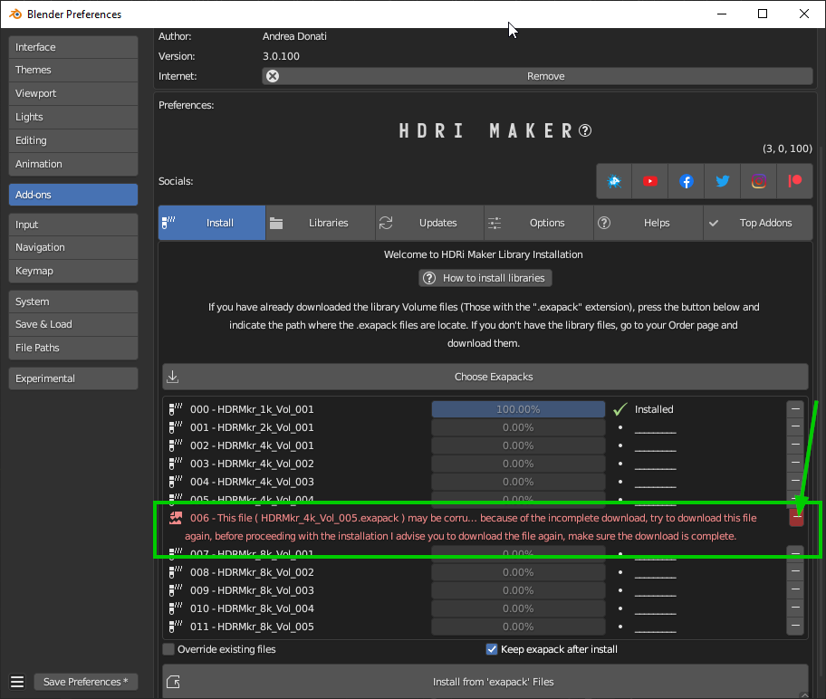

Installation
============

.. Note:: If you are already a HDRi Maker user and you currently have a version prior to 3.0.100, please
          uninstall it and proceed with the installation of this new version.
          If you already have a version 3.0.100 or higher, you do not need to uninstall the previous one.

------------------------------------------------------------------------------------------------------------------------

Instal the addon
-------------------------

The first step is to install the addon in Blender. Below are instructions for installing the addon

.. _mac_safari_zip:

Download the files
******************

**You can download the files wherever you want, but it would be better to create a temporary folder where to put them all**

In your product page, you can find various files, the main ones for the installation are the following:

- **hdri_maker_v301##.zip** is the addon for blender, this is the first element to download and install

  .. image:: _static/_images/installation/addon_zipped_01.png
      :align: center
      :width: 300
      :alt: Addon zipped 01

- **HDRiMkr_##_Vol_#.exapack** are the files of the library. and they are divided with increasing number.
  Example of downloaded .exapack files on the computer, below in the image:

  .. image:: _static/_images/installation/exapack_files_on_computer_01.png
      :align: center
      :width: 300
      :alt: Exapack files on computer

|

- **HDRMAPS_VOL_##.zip** These are the files of the library that I have inserted thanks to the support of the author of these backgrounds **Grzegorz Wronkowski**
  you can find these maps also on the site https://hdrmaps.com/ They are free and are granted under the CC BY license, you can find them at this
  link: https://hdrmaps.com/freebies/free-hdri-maps/

------------------------------------------------------------------------------------------------------------------------

The **.exapack** files are installed by the addon, they do not need to be installed manually! After installing the
HDRi Maker addon, it will manage your exapack packages and install them. (You will see in the following steps)

.. Note:: **For Mac users:** it often happens that Safari Browser is set to decompress .zip files, make sure this does not happen,
          otherwise the .zip file will no longer be a .zip file and you will not be able to install the addon as follows.

          Just go to the Safari menu bar at the top left and click on Safari>Preferences, then remove the check mark from
          "Open safe files after download" in the "General" window. Done, if in the future you download zipped files with safari,
          they will no longer be unzipped.

------------------------------------------------------------------------------------------------------------------------

Install Into Blender
********************

Now, download the addon and install it in Blender, the procedure is as follows:

1) Download the addon (Remember that you must be logged in to the site where you purchased the addon):

    - If you purchased on Blendermarket you can find the addon here:

       - https://blendermarket.com/account/orders

    - If you purchased on Gumroad you can find the addon here:

       - https://app.gumroad.com/library

    - Addon name Example: **hdri_maker_v30100.zip** (The number can be different, it depends on the version you are downloading)

   .. Important:: The addon file must remain in zip format! Do not unzip the file, otherwise you will not be able to install it correctly.
                  This note is especially for Mac users. If you do not know how to prevent Safari from decompressing zip files, take a look here :ref:`mac_safari_zip`

2) Once the addon is downloaded, open Blender and go to:

   ``Edit > Preferences > Add-ons > Install``

3) Select the downloaded file (**hdri_maker_v30100.zip** <-- !This name is only an example!) and click on "Install Addon" (The name of the file can be different from version to version)

4) If everything went well, the addon is in the list of installed addons, you can also search for it by typing "HDRi Maker"
   Mark the checkbox to activate it.

------------------------------------------------------------------------------------------------------------------------

.. _how_to_install_libraries:

Install The library
----------------------------

- If you have installed the addon correctly, now you can proceed with the installation of the library.

Step 1
******

Download the file HDRiMkr_1k_vol_1.exapack, this is the package containing the 1k resolution files,
it is also the smallest package in terms of Size, so it is easy and fast. You can download the others at any time.
**You can download all the .exapack files and run everything at once if you wish**

------------------------------------------------------------------------------------------------------------------------

Step 2
******

When you have finished downloading the **exapack** files you want to install, go to the HDRi Maker Preferences window
and go to the **Install Libraries** (TAB) section and press the "Default Library" button you see in the following image
in red.

.. Tip:: If you do not see the HDRi Maker Welcome panel, you can open it by pressing the "N" key on the keyboard.

When you press this button, a file browser will open, you will have to choose a location on your computer where the
root folder of the entire **Default Library** will be created

.. Warning:: 1. Do not choose the path in the path where blender installs the addons!
             2. Avoid choosing paths on LAN connected disks, resources may not be reachable
             3. If you are also installing the expansion.exapack, these will be installed in another root folder, in the same location where the **Default Library** is located
             4. It is not recommended to use an external Hard Disk connected via USB (Unless it is an external SSD disk)

------------------------------------------------------------------------------------------------------------------------

Step 3
******

Now the situation should look like this, where the **"Choose Exapacks"** button appears.

|

Press the **"Choose Exapacks"** button and select the **.exapack** files you just downloaded. You can choose them all,
just make sure to select them within the File Browser. **(The files not selected will be ignored)**
Then press the button in the file browser window **Choose Exapacks** to confirm

------------------------------------------------------------------------------------------------------------------------

Step 4
******

Now you should have the list of exapack files selected, in list, ready to be installed, you will just have to press the
**"Install From Exapack Files"** button to proceed with the installation. As follows in this image:

.. Note:: The exapack files are deleted once installed by the addon, this is for space issues
          if you want to keep them (Not Recommended) check the **"Keep Exapack After Install"** box and the files will be kept on the disk.
          But be careful, this means that you will have the weight of the library almost X2

During the installation process of the .exapack packages, the interface will show the progress of the installed packages
You can also stop the process whenever you want (Just press the button (X) next to the big status bar) in this case,
the installed packages will remain installed.

.. Important:: **I want to emphasize:** All installed packages will remain installed, even if the installation process is interrupted.
               If the installation is resumed, the installation process will resume from where it was interrupted,
               because the addon recognizes the already installed files and skips them.

.. image:: _static/_images/installation/exapack_installation_progress.png
    :width: 800
    :alt: Exapack installation progress

.. Note:: The installation speed depends a lot on the type of disk in use, I have done various tests, and the installation on
          SSD is very fast. I do not recommend the use of an external Mechanical Hard Disk connected via USB only for time issues,
          I noticed that these disks are very slow for this process. But if you do not have time problems and you have patience,
          you can decide to use it.

------------------------------------------------------------------------------------------------------------------------

Step 5
******

When you have completed the entire (or even just in part) installation, the addon will be ready to be used:
In this image we see that this Background is present in 3 different resolutions, 1k, 2k and 4k, the 8k and 16k versions
can be installed via exapack also at a later time (If needed)

.. Image:: _static/_images/installation/addon_ready_01.png
    :align: center
    :width: 600
    :alt: Addon ready 01

.. Note:: The 1k, 2k, 4k, 8k, 16k versions are present in the complete edition. Some versions may not contain all the resolution versions.
          If you want to upgrade to the full version, you only pay the difference

------------------------------------------------------------------------------------------------------------------------

At the end of this process, on your computer, in the indicated path, 2 folders will have been created (3 if you also installed the HDRMAPS expansion)

- **HDRI_MAKER_DEFAULT_LIBRARY** (This folder contains all the files of the HDRi Maker libraries)
- **HDRI_MAKER_USER_LIBRARY** (This folder is an empty folder, and will be used in case you want to save your personal HDRi)

If you also installed the HDRMAPS expansion, then a third folder will also be created and will be named after the expansion.

To manipulate the paths to the libraries, it is enough to go to the HDRi Maker settings and go to the **Libraries** (TAB) section

For more information on this section you can find the chapter :ref:`preferences_library_tab`

------------------------------------------------------------------------------------------------------------------------

Abouth Exapack
--------------

As for the libraries, from version 3.0.100 onwards, they will be distributed in the form of exapack packages.
All new packages will be in the form of numbered volumes Here is an example of nomenclature

Default Library
***************

- **HDRiMkr_1k_vol_1.exapack**: HDRiMkr 1k Volume 1: Contains files from 1k, previews, and data files
- **HDRiMkr_2k_vol_1.exapack**: HDRiMkr 1k Volume 2: Contains files from 2k, previews, and data files
- **HDRiMkr_4k_vol_1.exapack**: HDRiMkr 1k Volume 3: Contains files from 4k, previews, and data files
- **HDRiMkr_8k_vol_1.exapack**: HDRiMkr 1k Volume 4: Contains files from 8k, previews, and data files
- **HDRiMkr_16k_vol_1.exapack**: HDRiMkr 1k Volume 5: Contains files from 16k, previews, and data files

The packages are consecutive, Vol_1, Vol_2, Vol_3, I tried to limit as much as possible the size of the packages,
so that their maximum is around 2GB (Some can reach 2.5GB).
This limit to avoid download and installation problems, since those who have a slower connection, could
encounter timeout problems.

.. Note:: The large size packages like 8k and 16k will have more volumes, because they are much larger.
          The small size packages like 1k and 2k will have less volumes, because they are much smaller.

------------------------------------------------------------------------------------------------------------------------

Expansion Library
*****************

As for the expansions that are always distributed in the form of .exapack, the nomenclature may vary.
For example, the expansions of HDRMaps are distributed without the resolution variant, this because it is a much smaller library.

   .. image:: _static/_images/installation/hdrmaps_exapack_example_01.png
       :align: center
       :width: 300
       :alt: Expansion exapack nomenclature

------------------------------------------------------------------------------------------------------------------------

Problem with the installation
-----------------------------

Below are some problems that may occur during installation and how to solve them.
This section will be expanded as new problems are reported.

The addon does not install correctly
************************************

- Make sure to:

    - Use an official version of Blender downloaded from the official Blender website: https://www.blender.org/download/
    - Use a version preferably 3.0 or higher
    - Have enough space on the disk (The complete library takes up a lot of space)

------------------------------------------------------------------------------------------------------------------------

Problem with corrupted exapack
******************************

It can happen that during the download of an exapack, the download is interrupted for one reason or another.
Among the main causes of interruption of the download, there are:

- **The computer shut down unexpectedly**
- **The internet connection was interrupted**
- **The server timeout has been reached** --> To solve this problem, try to download fewer files at the same time

In these cases, the downloaded file may be damaged, and therefore it cannot be installed.
This you can check at the time of the installation of the damaged exapack, so download the damaged exapack again

