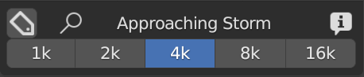

Main Panel
==========

Quick overview of the Main Panel:

.. |main_panel| image:: _static/_images/main_panel/main_panel_overview_01.png
                    :width: 800
                    :alt: Main Panel

+--+-------------------------------------+-+
|  |  1. :ref:`libraries_selector`       | |
|  |  2. :ref:`library_browser`          | |
|  |  3. :ref:`tag_search_size_selector` | |
|  |  4. :ref:`add_remove_buttons`       | |
+--+-------------------------------------+-+
|  | |main_panel|                        | |
+--+-------------------------------------+-+

------------------------------------------------------------------------------------------------------------------------

.. _libraries_selector:

Libraries selector
------------------

    - This area is used to choose the library, the category (of the library) and the category search via the text field.

Helps Button
************

    - This button opens the Help section in the addon preferences window. This is useful to find more information
      on how to use the addon

Library Selector (Drop-down menu)
*********************************

    - This allows you to select the background library you want to use. All libraries added via
      "Libraries" in the addon preferences menu will be displayed in this drop-down menu.
      By default this Drop-down menu, contains the "Default" library, which is the library that comes with the addon.
      and the "User" library, which is the library where you can add your saved backgrounds.

.. image:: _static/_images/main_panel/libraries_selector_popup_01.png
    :align: center
    :width: 400
    :alt: Libraries selector

Category Selector (Drop-down Menu)
**********************************

   - This allows you to select the category (Each library will have its own category)

.. image:: _static/_images/main_panel/category_selector_dropdown_01.png
    :align: center
    :width: 400
    :alt: Category selector dropdown

Search category by entering text
********************************

   - This allows you to search for a category by typing the name of the category

.. image:: _static/_images/main_panel/search_category_dropdown.png
    :width: 400
    :align: center
    :alt: Main Panel

------------------------------------------------------------------------------------------------------------------------

.. _library_browser:

Library Browser
---------------

   - This allows you to search for the preview in the current Library and Category.

Preview Popup
*************

   - This allows you to select the background (Each library will have its own background), a pop-up window will appear
     with the list of preview backgrounds

.. image:: _static/_images/main_panel/preview_icons_popup.png
    :width: 600
    :align: center
    :alt: Main Panel

UP-DOWN/LEFT-RIGHT Arrows
*************************

   - Up/Down arrows allow you to scroll through the list of categories Left/Right arrows allow you to scroll through
     the list of backgrounds (Into the selected category)

.. image:: _static/_images/main_panel/preview_icon_arrows_01.png
    :align: center
    :width: 300
    :alt: UP-DOWN/LEFT-RIGHT Arrows

Force reload icons
******************

    - If the preview is not loaded correctly, this allows you to reload the preview

.. image:: _static/_images/main_panel/force_reload_icons_01.png
    :align: center
    :width: 300
    :alt: Force reload icons

Options Button
**************

    - This button opens the Blender preferences window and goes directly to the "Options" section of HDRI Maker

------------------------------------------------------------------------------------------------------------------------

.. _tag_search_size_selector:

Tag Search Size Selector
------------------------

    - This small menu in the box, allows you to Select the size / version of the material (If there is an alternative)
      Contains The search for tag / background name and information on the background currently in the preview.

Search Background by entering text
**********************************

   - This allows you to search for a background by typing the name of the background (It work with the tag Restrictions if you need)

Search for tag
**************

   - This allows you to search for a background by typing the name of the tag
      - In the upper field, you can enter the name of the tag you want to include in the search
      - In the lower field, you can enter the name of the tag you want to exclude from the search

      Keep the tags separated with a space if you want to include more than one tag in the search.

      In this way, the categories and the previews will be filtered according to the tags entered.

.. image:: _static/_images/main_panel/tag_seatch_box_01.png
    :align: center
    :width: 400
    :alt: Search for tag

Info & Tag
**********

    - This button will open a dialog window with information about the background currently in preview.
      inside there will be information about the author, the license.
      There will also be the tags that have been assigned to the background, they can also be modified from here.

.. image:: _static/_images/main_panel/info_tag_panel_popup_01.png
    :align: center
    :width: 600
    :alt: Info & Tag Panel

Edit Tags
#########

    - In the info & Tag panel you can edit the tags assigned to the background.
      To do this, just click on the "Edit Tags" button and enter the desired tags.
      You can also delete existing tags, just press on them, and a dialog box will be displayed
      that will ask you if you want to delete the tag.

.. Note::
    - Tags can only be edited if you have checked the "Edit Tags" box

Material Version Selector
*************************

    - If in the library there are different versions of the same material, this selection allows you to choose which version to load (Press Add to confirm)

------------------------------------------------------------------------------------------------------------------------

.. _add_remove_buttons:

Add Remove Buttons
------------------

    - Add (From the preview) / Remove (From the scene) buttons

Add Button:
***********

.. |tcls| image:: _static/_images/main_panel/tools_category_light_studio_01.png
              :width: 300
              :alt: Tools Category Light Studio

- This button adds the selected background to the scene.
  Use Ctrl + Click to open the File Browser and import a background from an external file

.. Note:: If you are in the "Tools" category this button acquires the "Add Tool" function and allows you to add the tools
         included in the Tools directly to the scene. Example: In "Tools" -> "Light Studio" adds a solid color dome, And directional lights.

         +-------------------+-------------------+
         | Light Studio      | Import Background |
         +-------------------+-------------------+
         | |tcls|            | |tcli|            |
         +-------------------+-------------------+

Remove Button
*************

   - This button removes the world background from the scene.
     By default, it removes the HDRi Maker background and replaces it with the default Blender background.
     Press Shift+Click to remove completely the world background)

