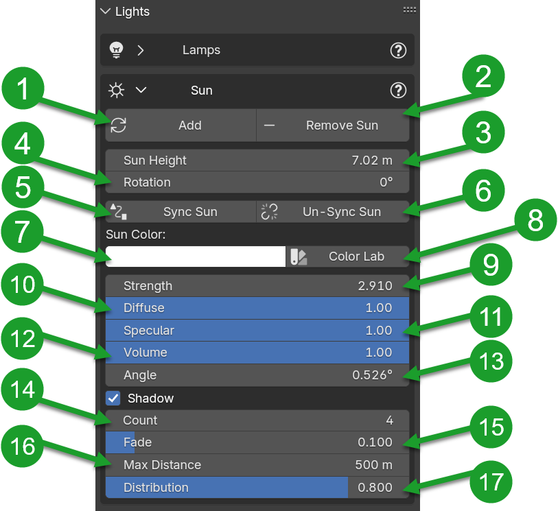

.. _light_section:

Lights
======

The light panel was introduced by version of HDRi Maker 3.0.100, and allows to create 2 types of lighting:
Solar / Studio Light

**Example of basic panel:**

.. |lights_panel| image:: _static/_images/lights/lights_panel_closed_01.png
                    :width: 500
                    :alt: Lights Panel

+----------------------+---------------------+--------------------------------+
| 1. :ref:`lamps_menu` | 2. :ref:`sun_menu`  | 3. :ref:`eevee_shadow_detail`  |
+----------------------+---------------------+--------------------------------+
|                          |lights_panel|                                     |
+----------------------+---------------------+--------------------------------+

.. _lamps_menu:

Lamps Menu
----------

Lamps allows you to create a set of lights at your own choice on the fly. It will create a Circle with anchored to it the set of lights.
It has in addition a target point (See yellow arrow in the image) this allows you to keep the lights pointed where you want.
(More you explain how to make the target point parent of the object you want to illuminate in order to be able to point
the lights also on objects that move)

.. image:: _static/_images/lights/lamps_and_target_01.png
    :width: 800
    :align: center
    :alt: Lights Panel

========================================================================================================================

.. Tip::
        You can find a video tutorial on how to use the Light studio: :ref:`light_studio`

**The panel looks like this once the lights have been added via the "Add" button:**

.. |lights_panel_lamps| image:: _static/_images/lights/lights_panel_lamps_01.png
                           :width: 800
                           :alt: Lights Panel Lamps

+-------------------------------------+--------------------------------+
|   - 1. :ref:`add_reload_remove`     |  - 2. :ref:`light_count`       |
|   - 3. :ref:`lamps`                 |  - 4. :ref:`target`            |
|   - 5. :ref:`light_type_area_shape` |  - 6. :ref:`lights_properties` |
+-------------------------------------+--------------------------------+
|             |lights_panel_lamps|                                     |
+-------------------------------------+--------------------------------+

 .. _add_reload_remove:

Add-Reload/Remove
*****************

These 2 buttons add or remove the set of lights, the amount of lights depends on the value "Light Count" set.
(At the moment only 1 set of lights can be added HDRiMaker 3.0.100)

.. _light_count:

Light Count
***********

This value (Integer) changes the number of lights connected to the set of lights, the addon will divide the circle evenly.

.. Note::
    If you increase the number of lights, these new ones will have the same properties as the last one at the bottom of the list.

.. _lamps:

Lamps
*****

Lamps changes the position of the set of lights on the X-Y-Z axis.

The button next to it (Link) is to link the set of lights to any object selected in the scene, this is useful
to make the set of lights move with the object indicated.

Per rimuovere la parentela, basta cliccare nuovamente sul pulsante "Link" poichè esso stesso è diventato "Unlink".

To unlink from parent object, just click again on the "Link" button because it has become "Unlink" itself.
Take a look in the image below:

.. image:: _static/_images/lights/link_unlink_parent_lamps_01.png
    :width: 400
    :align: center
    :alt: Link Unlink Parent Lamps

.. _target:

Target
******

Target is the point where the set of lights will be pointed, it is useful to keep the lights pointed at the object
you want to illuminate.

The target is an empty object that is created automatically when you add the set of lights, it is anchored to the set of lights.

Like a Lamps, the button next to it (Link) is to link the target to any object selected in the scene, this is useful
to make the target move with the object indicated in order to keep the lights pointed at the object you want to illuminate when it moves.

.. _light_type_area_shape:

Light Type / Area Shape
***********************

Light type allows you to choose between many types of lights:
 - Area: Enum into next property (Square, Disc, Rectangle, Ellipse)
 - Spot
 - Point

Depending on the type of light chosen, the panel below with the properties of the lights will change.

.. Note::
    Area type have a property called "Area Shape" that allows you to choose between 4 different shapes:
    (Square, Disc, Rectangle, Ellipse)

.. _lights_properties:

Lights Properties
*****************

This panel allows you to modify the values of the properties of each single light or all the lights together.

.. image:: _static/_images/lights/light_properties_01.png
    :width: 400
    :align: center
    :alt: Lights Properties

- **Energy Columns**: This column allows you to change the energy of each light individually.
- **Color Lab Button:** Open A Colorlab in order to get a colors palette (The color chosen will be applied to all the lights)
- **Color Columns:** (Under Color Button): This column allows you to change the color of each light individually.
- **Random Color:** This button allows you to randomize the color of the lights.
- **Size Columns:** This column allows you to change the size of each light individually.

.. Note::
    You can change the slider values all together simply by passing the mouse with the left button pressed
    this will allow you to change all the values at once.

- Colorlab Light preset:
    . Colorlab is a tool present in our addons, it allows you to search and apply colors quickly and easily.

    .. image:: _static/_images/lights/color_lab_lights_01.png
        :width: 300
        :align: center
        :alt: Lights Properties

========================================================================================================================

.. _sun_menu:

Sun Menu
--------

- The sun menu allows you to create a sun light and manage it in a simple way.

.. |sun_inactive_panel| image:: _static/_images/lights/light_sun_inactive_01.png
                        :width: 800
                        :alt: Sun Menu

.. |sun_active_panel| image:: _static/_images/lights/light_sun_active_01.png
                        :width: 800
                        :alt: Sun Menu

+-----------------------------------------------+-----------------------------------------------+
| **Panel Without HDRi Maker Sun in the scene** | **Panel when the sun has been added**         |
+-----------------------------------------------+-----------------------------------------------+
| |sun_inactive_panel|                          | |sun_active_panel|                            |
+-----------------------------------------------+-----------------------------------------------+

Sun Menu legenda
----------------

+-------------------------------------+-------------------------------------+
| - 1 :ref:`add_sun`                  | - 2 :ref:`remove_sun`               |
|                                     |                                     |
| - 4 :ref:`sun_rotation`             |                                     |
|                                     | - 6 :ref:`un_sync_sun`              |
| - 5 :ref:`sync_sun`                 | - 8 :ref:`sun_color_lab`            |
| - 7 :ref:`sun_color`                | - 9 :ref:`sun_strength`             |
|                                     | - 10 :ref:`sun_angle`               |
|                                     | - 11 :ref:`sun_max_bounces`         |
| - 12 :ref:`sun_cast_shadow`         |                                     |
| - 13 :ref:`sun_multiple_importance` |                                     |
| - 14 :ref:`sun_shadow_caustic`      |                                     |
|                                     | - 15 :ref:`eevee_shadow_detail`     |
+-------------------------------------+-------------------------------------+
|  |light_sun_legenda|                                                      |
+-------------------------------------+-------------------------------------+

.. _add_sun:

Add Sun
*******

- This button adds a sun in the scene, this is different from adding a sun manually via Blender,
  because this sun is recognized by HDRi Maker and can be managed via the Sun menu.

.. _remove_sun:

Remove Sun
**********

- This button removes the sun from the scene.

.. _sun_height:

Sun Height
**********

- This value is useful to change the height of the sun in the scene, in any position it is located.

.. _sun_rotation:

Sun Rotation
************

- This slider manage the rotation of the sun around the point 0,0,0 of the scene. It is managed by an "Empty" object that rotates,
  the sun consequently rotates with it, keeping the same distance from the center of the scene.

.. _sync_sun:

Sync Sun
********

- This button syncs the sun with the background, in fact, if you rotate the sun after pressing this button,
  the background will rotate accordingly. (Useful if you want to keep the sun consistent with the background)

.. _un_sync_sun:

Un Sync Sun
***********

- This button removes the synchronization of the sun with the background.

.. _sun_color:

Sun Color
*********

- This allows you to change the color of the sun.

.. _sun_color_lab:

Sun Color Lab
*************

- This button opens a color lab in order to get a colors palette (The color chosen will be applied to the sun)

.. _sun_strength:

Sun Strength
************

- This slider allows you to change the strength of the sun.

.. _sun_angle:

Sun Angle
*********

- Angular diameter of the sun, as seen from the earth.

.. _sun_max_bounces:

Sun Max Bounces
***************

- Maximum number of times light from the light is allowed to Bounce. Limited by scene-wide bounce settings.

.. _sun_cast_shadow:

Sun Cast Shadow
***************

- Light casts shadows

.. _sun_multiple_importance:

Sun Multiple Importance
***********************

- By default lights use only direct light sampling. For area lights and sharp glossy reflections, however, this can be noisy, and enabling this option will enable indirect light sampling to be used in addition to reduce noise.

.. _sun_shadow_caustic:

Sun Shadow Caustic
******************

- Mark a light as a refractive caustic caster. This setting can be used in conjunction with the Cast and Receive caustics object settings to selectively speed up refractive caustic rendering of select objects.

.. _eevee_shadow_detail:

Eevee Shadow Detail
-------------------

This is a selector of Eevee shadow detail level. I compiled in it some presets that automatically modify the settings
of the Eevee shadow detail level (Only works with Eevee)

Enum In (Very Low, Low, Default, High, Very High, Ultra)

The level of detail greatly affects the performance of Eevee, so it is necessary to choose carefully the level of detail,
it can be changed at any time.

