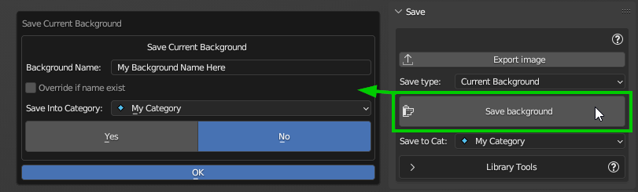

Save
====

This section of the addon is dedicated to the background saves, the export, and the creation of 360° backgrounds from a scene.

There is also a section to manipulate the user library.

.. Tip:: You must be in User Library to be able to manipulate and save your backgrounds!

.. image:: _static/_images/save/save_panel_01.png
  :width: 600
  :align: center
  :alt: Save Panel Overview

**1 - Export Image**
--------------------

If in the current scene there is a World and in the nodes of the world there is one or more images in the nodes of type "TEX_ENVIRONMENT"
This button allows you to export the image / s and save them in the chosen directory.

**2 - Save Type**
-----------------------

This area allows you to choose 3 types of saving options:

.. image:: _static/_images/save/save_type_01.png
  :width: 300
  :align: center
  :alt: Save Panel Overview

.. Note:: Prima di procedere al salvataggio è necessatio creare una categoria nuova o selezionarne una esistente nella
          User Library. Per fare questo, trovi qui la sezione dedicata alla manipolazione della User Library:
          ..TODO: link "Library Tools"

Save Current Background
***********************

This Options allows you to save the current background into the User library. The user library is your personal library,
where you can save your own backgrounds.

To proceed with the save, you must press the "Save Background" button, a popup will appear that you can see below:

- **Background Name:**
    The name of the background to be saved. You can choose the name you want, but it must be unique into the current category.

- **Overrite if name exists:**
    If you have already saved a background with the same name, this option allows you to overwrite it.

- **Save Into Category:**
    This option allows you to choose the category where to save the background. (Must be created before)

When everything is ready, select "Yes" and press the "Ok" button to proceed with the save.

If the background type is based on Images, HDRi Maker will try to save only the main image.
Otherwise, the whole world node tree will be saved (All world node tree nodes).

------------------------------------------------------------------------------------------------------------------------

Batch From Foder
****************

.. image:: _static/_images/save/batch_from_folder_panel_01.png
  :width: 300
  :align: center
  :alt: Batch From Folder Panel

Questa opzione, ti permette di salvare in Batch (Cioè molti Backgrounds in una volta sola). Se hai una cartella con tanti
file HDR, oppure con dei Blender file con un mondo già impostato, questa opzione fa tutto il resto.

Per procedere è necessario Selezionare la cartella dove sono contenuti i file da salvare, e poi premere il pulsante "Batch Save".

