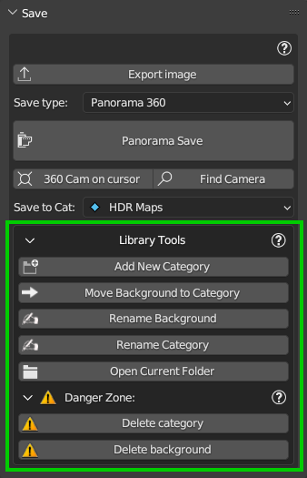

Save
====

This section of the addon is dedicated to the background saves, the export, and the creation of 360° backgrounds from a scene.

There is also a section to manipulate the user library.

.. Tip:: You must be in User Library to be able to manipulate and save your backgrounds!

.. |save_panel| image:: _static/_images/save/save_panel_01.png
                  :width: 800
                  :alt: Save Panel Overview

+------------------------+---------------------+-------------------------+
| 1. :ref:`export_image` | 2. :ref:`save_type` | 3. :ref:`library_tools` |
+---+--------------------+---------------------+---------------------+---+
|   |       |save_panel|                                             |   |
+---+----------------------------------------------------------------+---+

.. _export_image:

Export Image
------------

If in the current scene there is a World and in the nodes of the world there is one or more images in the nodes of type "TEX_ENVIRONMENT"
This button allows you to export the image / s and save them in the chosen directory.

.. _save_type:

Save Type
---------

This area allows you to choose 3 types of saving options:

.. Note:: Prima di procedere al salvataggio è necessatio creare una categoria nuova o selezionarne una esistente nella
          User Library. Per fare questo, trovi qui la sezione dedicata alla manipolazione della User Library:
          ..TODO: link "Library Tools"

Save Current Background
***********************

This Options allows you to save the current background into the User library. The user library is your personal library,
where you can save your own backgrounds.

To proceed with the save, you must press the "Save Background" button, a popup will appear that you can see below:

.. image:: _static/_images/save/save_current_background_panel_01.png
  :width: 800
  :align: center
  :alt: Save Current  Panel

- **Background Name:**
    The name of the background to be saved. You can choose the name you want, but it must be unique into the current category.

- **Overrite if name exists:**
    If you have already saved a background with the same name, this option allows you to overwrite it.

- **Save Into Category:**
    This option allows you to choose the category where to save the background. (Must be created before)

When everything is ready, select "Yes" and press the "Ok" button to proceed with the save.

If the background type is based on Images, HDRi Maker will try to save only the main image.
Otherwise, the whole world node tree will be saved (All world node tree nodes).

------------------------------------------------------------------------------------------------------------------------

Batch From Folder
*****************

   - This option allows you to save in Batch (That is, many backgrounds at once). If you have a folder with many HDR files,
     or with Blender files with a world already set, this option does the rest.

     To proceed, you must select the folder where the files to be saved are located (Choose the source folder button),
     and then press the "Batch Save" button.

.. image:: _static/_images/save/batch_from_folder_panel_01.png
  :width: 300
  :align: center
  :alt: Batch From Folder Panel

Once the "Batch Save" button is pressed, a dialog box will appear that will allow you to check which files
have been added to be processed and saved.

You can remove a file from the list before proceeding, you can click on the button with the "X", it will disappear from the list and will not be saved in the batch process.

.. Tip:: Even the .blend files can be added to the list, HDRi Maker will try to load the world in the file (If present)
          and save it in your User Library. The operation can succeed only if there is a world already set in the .blend file.

During the Batch process, a small panel will appear in HDRi Maker with the name "Batch Mode" where the progress of the save will be shown.

You can press the ESC button to stop the process.

.. image:: _static/_images/save/batch_save_progress_bar_01.png
  :width: 300
  :align: center
  :alt: Batch Save Progress Bar

.. Note:: The interface should lock for a few seconds during the batch process. About 3 seconds of waiting between one
          save and the other have been programmed, to be able to interact and possibly stop the process during those
          3 seconds. This is because a Blender Modal Operator has been used.

------------------------------------------------------------------------------------------------------------------------

Save 360° Background
********************

   - Save the scene in an image taken from the point of view of the 360° camera.
     This option is useful to create panoramic images to be used as backgrounds also in other programs.
     The images created can also be exported in HDR format

This is useful if you have particularly complex scenes and want to create a 360° background to use in other projects.
In many cases this saves the rendering time, because you will not need the original scene, which usually includes a
very high Polygon Faces and Vertices count.

   - Once this option is chosen, a "Add 360 sphere" button will be shown, this is used to place a sphere in the scene
     that will be the exact point from which the 360° image will be taken. (Like te image above)

.. image:: _static/_images/save/add_360_sphere_button.png
  :width: 300
  :align: center
  :alt: Save 360° Panel

.. Tip:: I suggest taking the picture between 1.5 and 2.5 meters high from the ground. In order to have a point of view
         of the height similar to that of human eyes.

Once the 360 sphere is added to the scene:

   - **360 Cam On Cursor**:
        This option allows you to place the 360 sphere on the cursor position.

   - **Find Camera**:
        This button, places the point of view in front of the sphere, if for some reason you can't find where you placed it.

Panorama Save Panel
###################

You must press the "Panorama Save" button, a popup will appear that you can see below:

.. image:: _static/_images/save/panorama_save_panel_01.png
  :width: 800
  :align: center
  :alt: Panorama Save Panel

- **Background Name:**
    The name of the background to be saved. You can choose the name you want, but it must be unique into the current category.

- **Custom Size:**
    This option allows you to insert a custom size expressed in k, 1 = 1k (1024x512), 2 = 2k (2048x1024), 4 = 4k (4096x2048), etc.
    (Use only Integers)

- **Use HDRi Maker Render Attributes:**
    If active, use the best parameters for the precompiled 360 render. If disabled, use the current scene parameters.
    (Recommended)

- **Size Selctor:**
    This option allows you to choose a size from a list of precompiled sizes.

- **Use Denoising:**
    If active, use the denoising filter to reduce noise in the render.
    More options will be available in the "Denoising" section if this option is active.

- **Render Samples:**
    This option allows you to choose the number of samples to be used in the render. (Recommended 128 or more)
    The higher the number of samples, the cleaner and more detailed the render will be, but the longer it will take to be completed.

- **Ok Button:**
    This button allows you to start the 360° render.

.. Note:: During the rendering, a Blender window will open with the rendering in progress. This window is necessary
          to be able to interrupt the rendering if necessary. Do not close this window, otherwise the rendering
          will be interrupted and you will not be able to save the background. When the render is finished, a confirmation
          message will be shown in the same window. !! do not interrupt the rendering !!

          - **During Rendering**:

          .. image:: _static/_images/save/360_during_render_example_01.png
            :width: 400
            :align: center
            :alt: Panorama Save Popup

          --------------------------------------------------------------------------------------------------------------

          - **After Rendering completed**:

          .. image:: _static/_images/save/RENDER_FINISHED.png
            :width: 400
            :align: center
            :alt: Panorama Save

.. _library_tools:

Library Tools
-------------

   - This submenu is dedicated to the manipulation of the User Library (The library where you can save your Backgrounds).

Add New Category
****************

   - This option allows you to add a new category to the User Library. It is not allowed to add more than one category
     with the same name (Lowercase and uppercase do not make a difference)

Move Background to Category
***************************

   - This option allows you to move a background from one category to another.
     (If the name of the background exists in the destination category, the background will not be moved)

Rename Background
*****************

   - This option allows you to rename a background. If the name is already present in the current category, the operation will not be completed.

Rename Category
***************

   - This option allows you to rename a category. If the name is already present in the User Library, the operation will not be completed.

Open Current Folder
*******************

   - For convenience, this button opens the current folder of the user library, so that you can access and check the saved files.

Danger Zone
***********

   - This section contains the options to delete categories and backgrounds from the User Library.

    .. Note:: The deletion of a category will also delete all the backgrounds contained in it.

