Troubleshooting
===============

In this section there are some tips to solve known problems.
This section will be updated over time based on the major problems encountered by users.
Problems related to HDRi Maker bugs are usually solved. Here are some of the most common problems.
Question and answer

I do not receive mail from BlenderMarket
-----------------------------------------

Make sure you consented to receive emails from creators in your Blender Market account preferences:
https://blendermarket.com/account/privacy-center/consents

------------------------------------------------------------------------------------------------------------------------

Find Options Menu
------------------

To go to the HDRi Maker options, you have to go to the addon preferences. But to make this process easier there is
a button directly in the HDRi Maker interface:

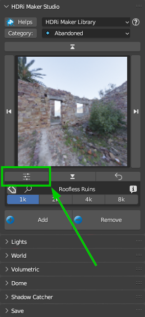

------------------------------------------------------------------------------------------------------------------------

The rotation of the background changes when I render
-----------------------------------------------------

1 - Make sure you have synchronized :ref:`vector_properties` and :ref:`dome_vectors` with the Dome/Background rotation
    and that you have not inserted animation keyframes in the sliders.
2 - Make sure there is no third-party addon installed that may interfere with the rotation of the camera, in the past I had a report
    with an addon that interfered with the rotation of the Background.

------------------------------------------------------------------------------------------------------------------------

Pink Background
---------------

If you find yourself in a situation of background or Dome with Pink color, this means in 99% of cases that the image
to which the background refers is no longer linked to the project.

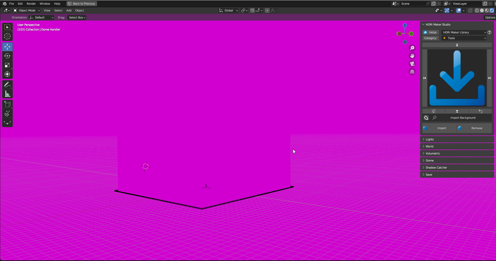

To solve the problem, go to the HDRi Maker options and click on the "Find Lost Images" button

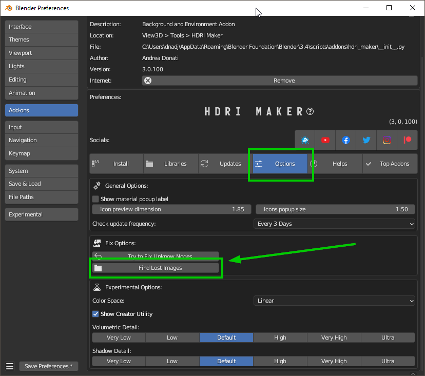

A file search window will open. Indicate the path where the HDRi Maker library is located or where you think
that the file you are looking for may be. Once the path is indicated, click on "Find Missing Files".

The search will be performed in the indicated path and in all subfolders.

**Note**: The process may take a while, depending on the number of files in the library.

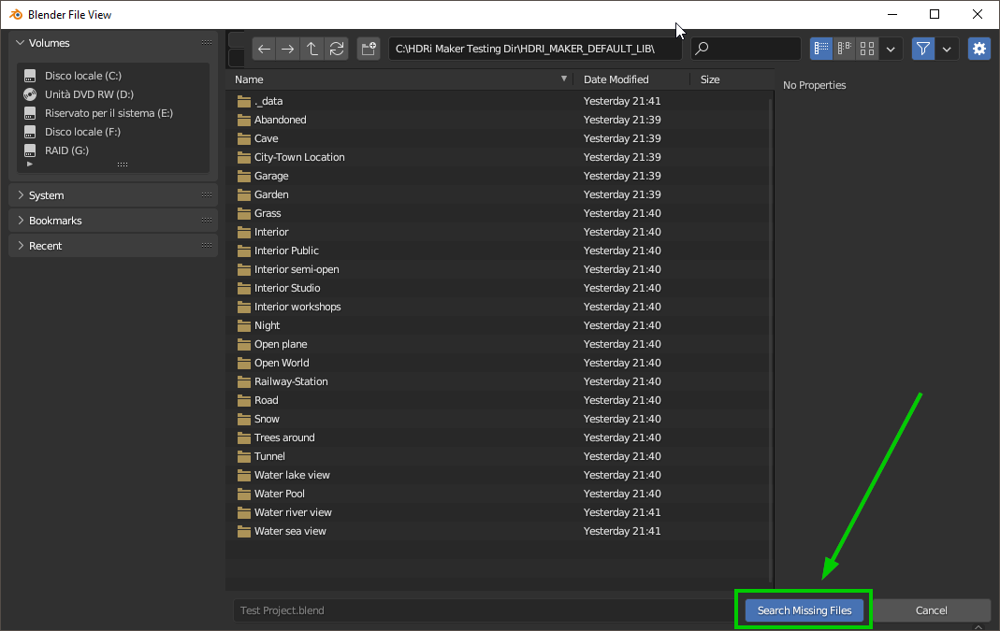

------------------------------------------------------------------------------------------------------------------------

Black Background
----------------

In this case there may be a problem when creating a file in a newer version of Blender, and then after saving the project
it is opened in a previous version of Blender.

Sometimes Blender updates its nodes, so it may be that the nodes are no longer retro compatible with the previous version.
To solve this I have provided a function that tries to replace the "Unknown" nodes

You can find it in the HDRi Maker Options menu:

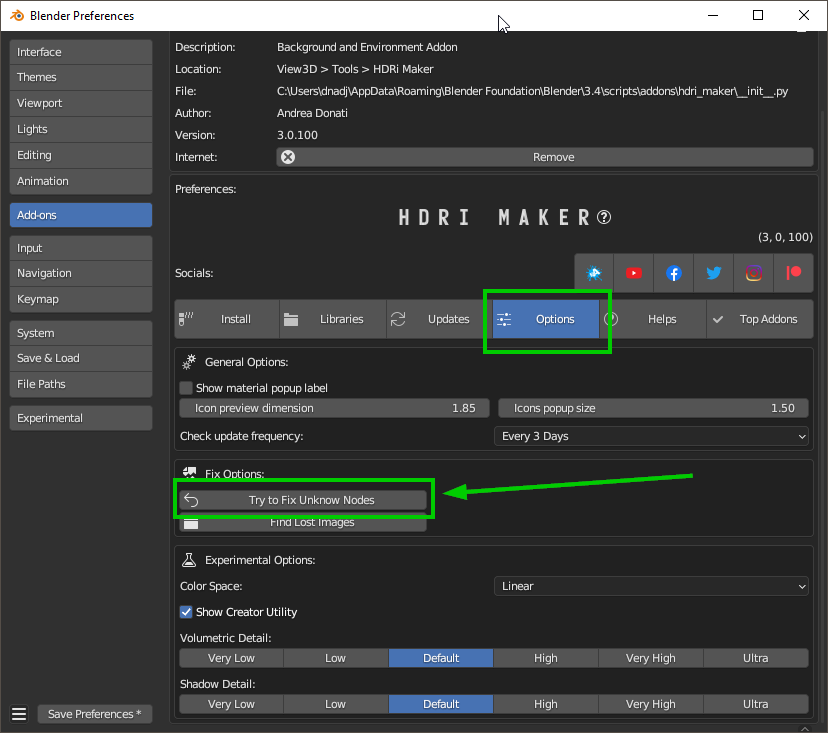

------------------------------------------------------------------------------------------------------------------------

Projection distorted
--------------------

* **Distorion Example:**

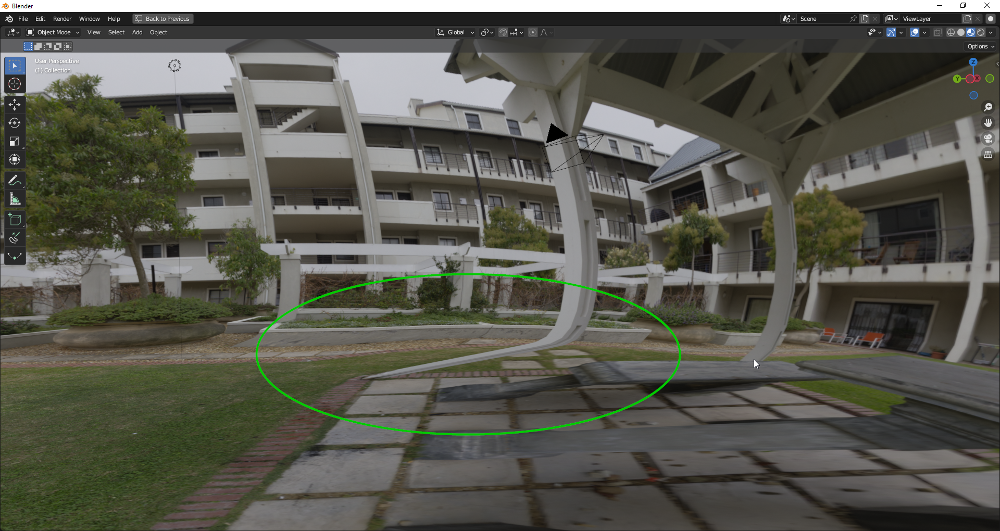

The projection of the dome is a great feature but not all images can be projected correctly.

First of all, keep in mind that the image is 2D and does not have the characteristics of the parallax, for example:
**Everything behind a tree in reality can be seen by turning around the tree, In an image No**

Keep this rule in mind.

The same thing applies to an object like a "Stick", the stick could result "Splamato" on the floor especially if the image
the stick is very close to the camera.

Another example is that the image is taken in a point of the grass. Obviously you will only see the grass from one direction, that is
from the center to the outside of the imaginary circle that forms the grass. But if you look at the image from another point.
If in the projections you try to frame the grass from the outside point to the center, you will see that the grass is "Splamato" on the floor.

This can be solved by using a CUBE type dome and using the Hooks system to modify the perimeter of the dome here the page: :ref:`dome_hooks`
In addition you can use the "Dome Vectors" submenu to correct the projection: :ref:`dome_vectors`

------------------------------------------------------------------------------------------------------------------------

Moving libraries to another computer
------------------------------------

(Only for HDRi Maker 3.0 or higher versions)

To move the libraries to another computer, just copy the "HDRI_MAKER_DEFAULT_LIB" and "HDRI_MAKER_USER_LIB" folders
if you also have the "Hdr Maps" library (Expansion) move it to the destination disk.

If once connected the libraries from the "Libraries" menu in HDRi Maker preferences the addon does not work,
it could be that in the folders mentioned above, the "._data" folders are missing, so make sure they are inside each library.

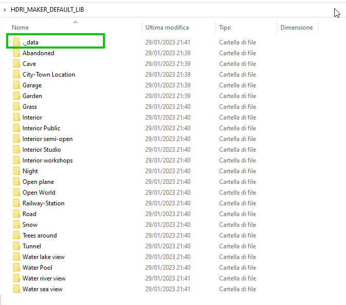

- **To Show the hidden folders in Windows:**

    1. Open File Explorer from the application bar.
    2. Select View > Options > Modify folder and search options.
    3. Select the View tab and in Advanced settings, select Show hidden folders, files and drives and OK.

- **To Show the hidden folders in Mac:**

    1. Access the folder where you think there are hidden files.
    2. Step 2: Press the keys "Command + Shift + (.)"

    Or:

    1. In Finder, open up your Macintosh HD folder
    2. Press Command+Shift+Dot
    3. Your hidden files will become visible. Repeat step 2 to hide them again!

- **To Show the hidden folders in Linux:**

    Press the menu button in the top-right corner of the window and select Show Hidden Files, or press Ctrl+H.

------------------------------------------------------------------------------------------------------------------------

Why if I export the project to another computer I can no longer see the backgrounds?
-------------------------------------------------------------------------------------

This is quite normal, by default blender does not package images in .blend files, to do this you have to go to

- File > External Data > Automatically Pack Resources

Then save the project, and finally you can move it to any other computer. It will contain all the images you used.

Pay attention to this, because your .blend files after these operations will contain all the image files present
in your project is present an image of 100MB (For example) your .blend file will become 100MB more.

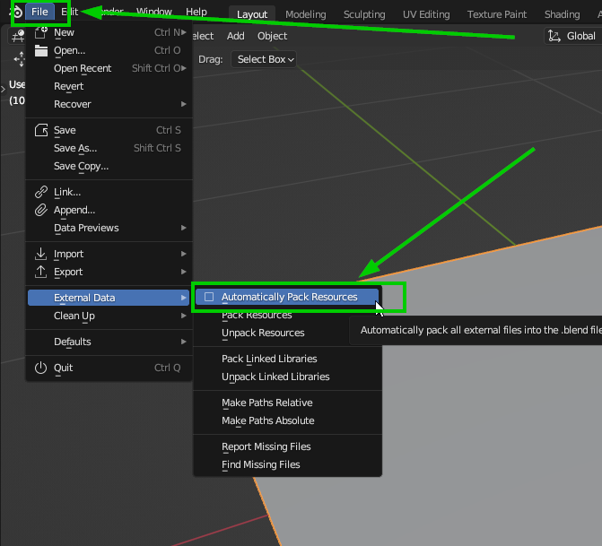

------------------------------------------------------------------------------------------------------------------------

A darkness circular gradient appears on the ground in the center. How can i fix that?
------------------------------------------------------------------------------------------

Depending on the lighting of the scene, you may have a Dark Ground, this is the area that captures the shadows, so everything is ok,
you need to fix the ground exposure values (Follow the next Image)

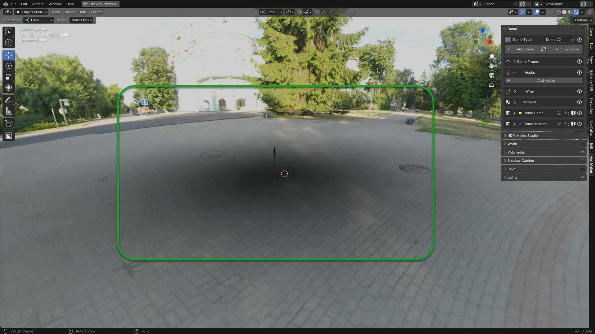

|

In order to fix the ground exposure values, it is sufficient from the **Dome** panel and from the **Dome Color** submenu
modify the **Exposure Ground** property, raising the exposure value until you have a right lighting as
in this example:

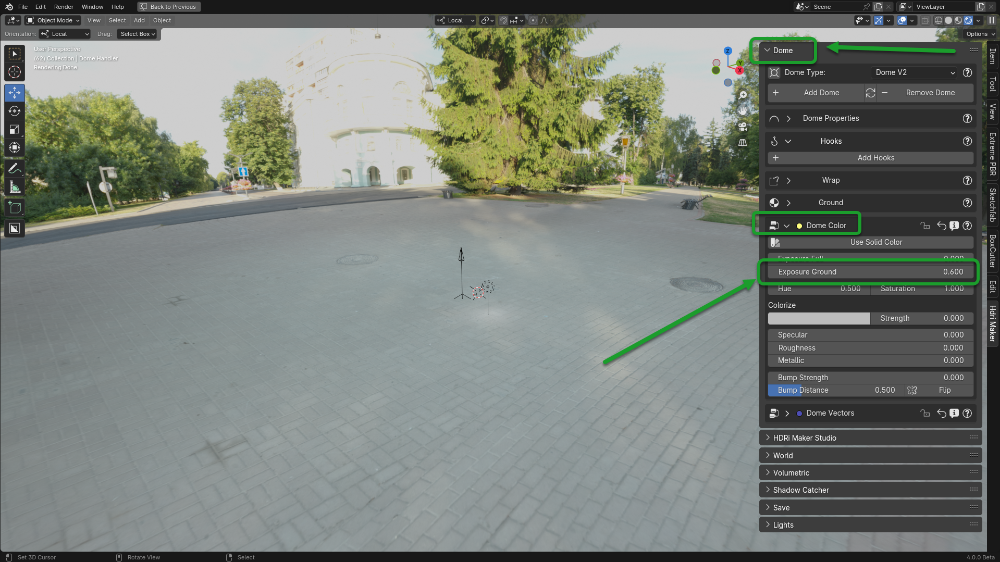

------------------------------------------------------------------------------------------------------------------------

Material icons not visible
---------------------------

A problem is quite well known with the Blender Template Preview Icons, which in some situations may not be
loaded correctly by the addon, to solve this problem a Button has been inserted which once pressed, reloads
the Icons, making it possible to view them correctly. Here you will find the paragraph that indicates the button::ref:`force_reload_icons`

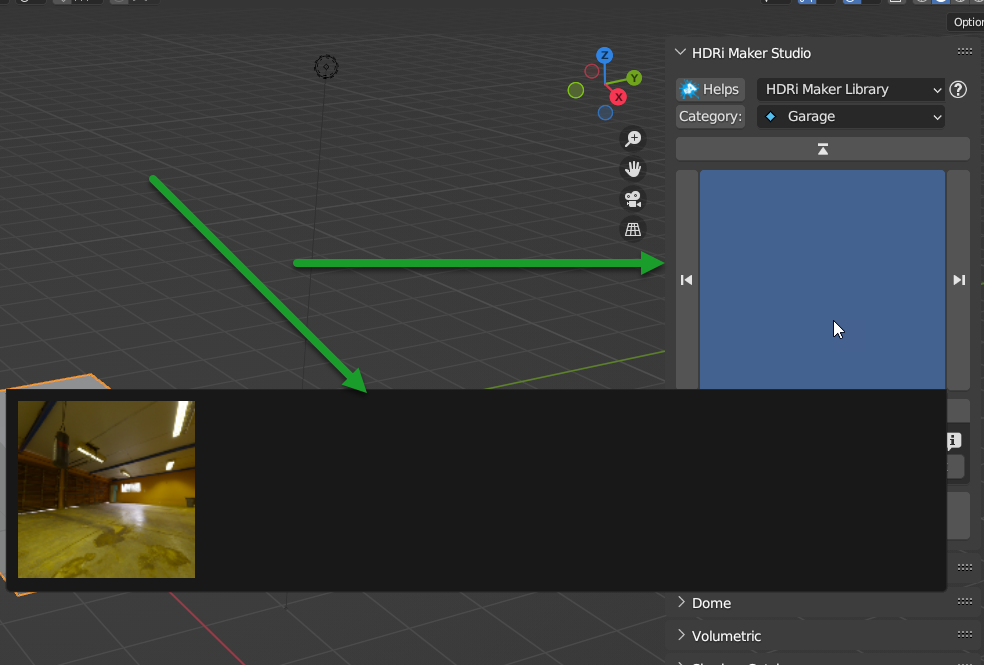

