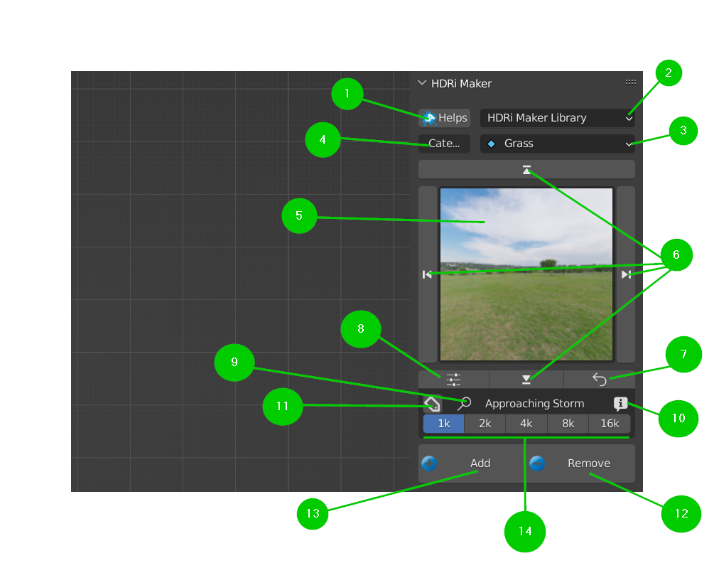

Main Panel (Library Manager)
============================

Rapid look at the main panel buttons:
-------------------------------------

.. enumerate:

* 1. Help Button:

   - This is the tooltip for the Help button in the main panel

* 2. Library Selector (Drop-down menu):

   - This allows you to select the library (by default choose between Default Library and User Library)

* 3. Category Selector (Drop-down Menu):

   - This allows you to select the category (Each library will have its own category)
