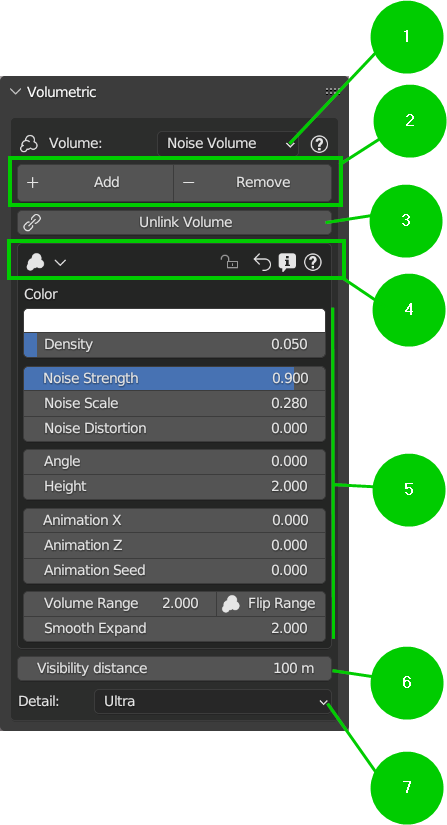
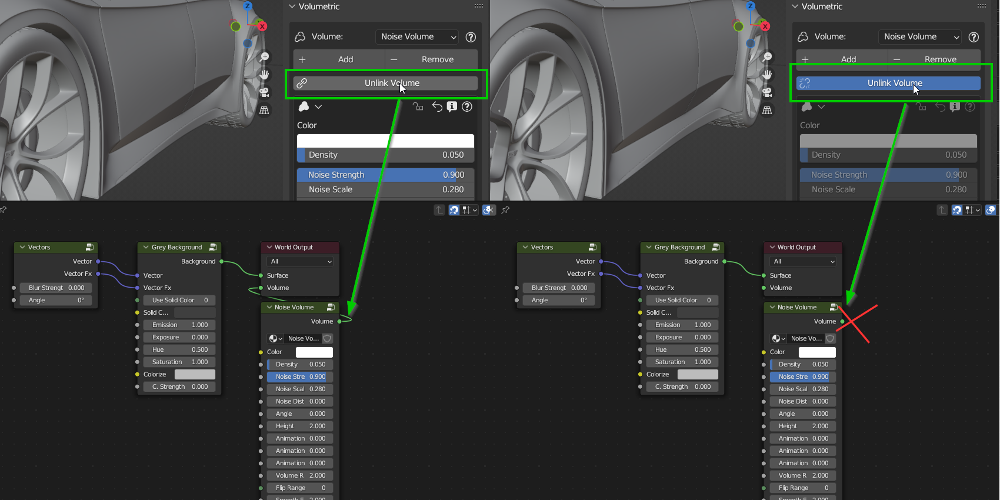
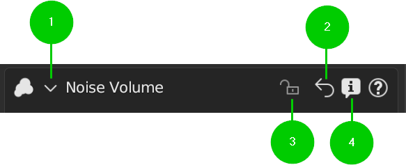
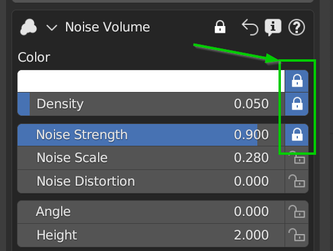
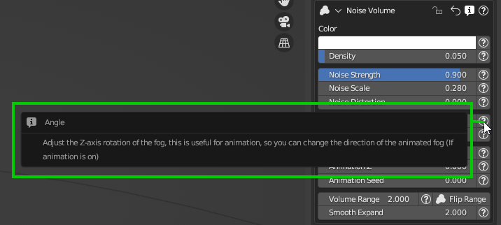
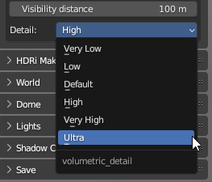

Volumetric
==========

.. figure:: _static/_images/volumetric/car_into_fog_01.jpg
    :scale: 40 %
    :align: center
    :alt: car_into_fog_01

This section of the addon is dedicated to the creation of a Volumetric environment, ie an environment with a simulation
of "Fog" or "Dust" in the air. This type of effect is very used in films and video games to create a more realistic atmosphere,
especially if used with adequate lighting (See the "Lights" section ..TODO for more information).

------------------------------------------------------------------------------------------------------------------------

------------------------------------------------------------------------------------------------------------------------

1. Volume Selector
******************

The Volume Selector allows you to choose the volume to add to your scene. In the HDRi Maker package there are some types of
volumes. This one we take as a reference is a type of "Noise" volume (Volumes may vary from version to version).

------------------------------------------------------------------------------------------------------------------------

2. Add/Remove (Volume)
**********************

These two buttons add or remove the volume from the scene. If the volume is already present in the scene, the "Add" button
replaces the volume already present with the one selected. If the volume selector volume is the same, the volume is reloaded
anyway, returning to its default properties.

------------------------------------------------------------------------------------------------------------------------

3. Unlink Volume
****************

Unlink Volume disconnects / reconnects the volume group node, from the world output node. This allows you to hide the volume
from the scene, saving many resources, especially during work, when you don't want to lose the volume settings, but you need
to hide it.

.. Note:: When the volume is disconnected, in the user panel, it is not possible to interact with the properties in the
          volume panel below. This is to avoid confusion, as they would have no immediate effect.

------------------------------------------------------------------------------------------------------------------------

4. Volume Node Header
*********************

1. Open/Close Panel
###################

This button opens or closes the volume panel. This is useful if you want to hide the volume node group panel.

2. Restore Default
##################

This button restores all the default values of the volume in one go. (To lock the values see the next point)

3. Lock/Unlock
##############

This button allows you to show next to all the properties of the node, a small lock, which allows you to lock the value of the
property. This is useful if you want to lock a value if you intend to restore the values through "Restore Default", in this way
the value will not be restored while the others are not locked.

4. Show Info
############

If pressed, it allows you to show information about the properties of the node, if they exist, a button (?) next to the
property will be shown, pressing it, a popup will be shown with the description of the property, as in this image:

------------------------------------------------------------------------------------------------------------------------

5. Volume Node Panel
********************

The Volumetric Group Nodes are redrawn to measure in this area, the panel is pre-drawn. For information on the operation,
see the "Tutorials" section ..TODO

------------------------------------------------------------------------------------------------------------------------

6. Visibility Distance
**********************

This slider allows you to set the visibility distance of the volume. This is useful if you want to hide the volume at a certain
distance, to avoid wasting resources.

------------------------------------------------------------------------------------------------------------------------

7. Detail
*********

This selector allows you to choose the level of detail of the volume. This feature has been preset with presets to automatically
set the level of detail of the volume.

 - Values: (Very Low, Low, Default, High, Very High, Ultra)

Noise Volume (Node Group)
*************************

This Group is basically created to manage an animatable fog simulation, with Patches adjustable in size and intensity.
It also simulates the wind or ascensional effect. You can adjust a range in which the fog must operate,
you can set a few meters of fog (Example from 0 to 2 meters there is fog, beyond this limit on the Z axis it will not be shown)
You can also invert the range of it or expand fully for total immersion in the mist. It is also useful for simulating
the "Suspended Dust" present in some situations.

**Inputs:**

1. **Color  (Rgba)**

 - Adjust the color of the fog

2. **Density  (Value)**

 - Adjust the intensity of the fog

3. **Emission Strength  (Value)**

 - Adjust the emission of the Volume. 0 = No Emission

4. **Noise Strength  (Value)**

 - Adjust the intensity of noise in fog (Subtractive)

5. **Noise Scale  (Value)**

 - Adjust the size (Scale) of the fog, the higher the scale, the smaller the patches

6. **Noise Distortion  (Value)**

 - Adjust the distortion of the fog. It needs to have the "Noise Strength" value greater than 0

7. **Angle  (Value)**

 - Adjust the Z-axis rotation of the fog, this is useful for animation, so you can change the direction of the animated fog (If animation is on)

8. **Height  (Value)**

 - Move the fog bank up or down on the Z-axis

9. **Animation X  (Value)**

 - Adjusts the speed of the fog's Horizontal (x) axis animation. If speed is 0 no animation. To adjust the direction, use the "Angle" slider. Requires Blender play animation to see the animation

10. **Animation Z  (Value)**

 - Adjusts the speed of the vertical (z) axis animation of the fog. If speed is 0 no animation. To reverse direction, use Positive or Negative values. Requires Blender play animation to see the animation

11. **Animation Seed  (Value)**

 - Animate the fog noise generator seed. This animation has no direction.

12. **Volume Range  (Value)**

 - Adjust the thickness of the fog bank. If you use "Flip Range" the fog bank will be above and below. (inverted)

13. **Flip Range  (Button)**

 - The Fog bank will be Inverted.

14. **Smooth Expand  (Value)**

 - Adjust the smoothness of the Fog bank. The value closest to 0 means a sharp break in the fog bank.

